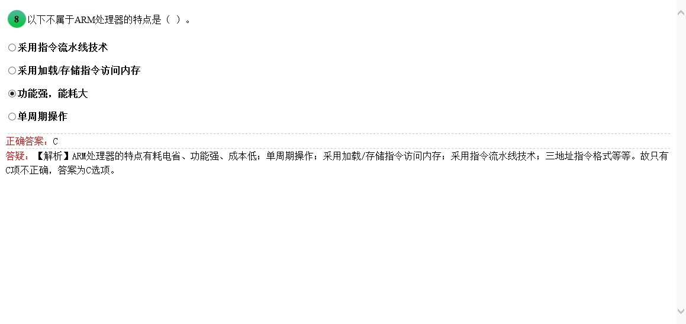
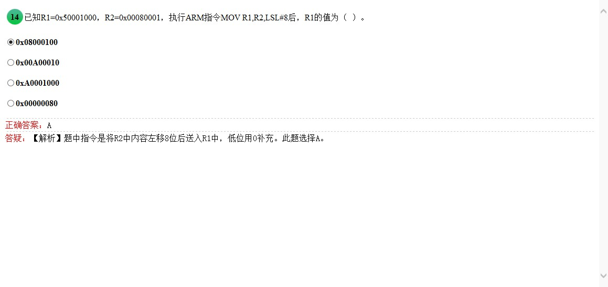

<!-- more -->

# 1 选择题

## 1.1 


> 如图所示参考书P26

## 1.2


> 巨型机和服务器太大了，当然不是了

## 1.3


> 如图所示

## 1.4


> 如图所示一张为 ``` 4096*3072*24/8/1024/1024=36M ``` 为36M，一共```36M/n*400/1024<=4``` n>3.515,选接近的4

## 1.5


> 额，单位是G HZ来着

## 1.6


> 不吐槽，不解释

## 1.7


> 不吐槽，不解释

## 1.8


> 能耗不大

## 1.9


> 不吐槽，不解释

## 1.10


> 不吐槽，不解释

## 1.11


> 不解释

## 1.12


> MPU保护内存

## 1.13


> 详见书 **P81**
## 1.14


>是十六进制一个0代表4位。。。

## 1.15


>不解释

## 1.16


>不解释

## 1.17


>不解释

## 1.18


>不解释

## 1.19


> 话说的太绝对

## 1.20


> #号貌似 应该是低电平有效 ，[AM29LV320D 数据表 (PDF)](http://pdf1.alldatasheetcn.com/datasheet-pdf/view/163391/SPANSION/AM29LV320D.html)

## 1.21


>IIC 只有两更新 SDA SCL

## 1.22


>MOSI就是对MOSI。。。。，不是答案A，而是答案C

## 1.23


>不解释

## 1.24


>我了个大草，USB是同步的，时钟是隐藏的

## 1.25

>不解释

## 1.26


>不解释

## 1.27


>动车自动驾驶硬实时

## 1.28


>不解释

## 1.29


>不解释

## 1.30


>中间件和HAL两个概念。。。

## 1.31


>不解释

## 1.32


>两个都是嵌入式操作系统

## 1.33


>不解释，详见书USOSII这一章节

## 1.34


>同上，不解释

## 1.35


>不解释

## 1.36


>不解释

## 1.37


>不解释

## 1.38


>不解释

## 1.39


>不解释

## 1.40


>不解释

# 2 填空题

## 2.41_42


>不解释

## 2.43_44


>不解释

## 2.45_46


>[mpeg4和MP4有什么区别](https://zhidao.baidu.com/question/207675479.html)

## 2.47_48


>不解释

## 2.49_50


>我日 R0是 0x0不是0，擦擦擦，格式要注意

## 2.51_52


>搞不懂 SUB和SUBHI什么区别

## 2.53_54


>[ADD和ADC区别](https://www.zybang.com/question/20b8a81e7970f0f9ff1085a11ae82697.html)

## 2.55_56


>FUCK 啊，R1现在为0了，说好的带0x呢？骗子，掌握不了规律，好气人

## 2.57_58


>MD，第二个答案名字这么长 再写一遍  ARM Cortex嵌入式处理器

## 2.59_60


>跟我一起读 嵌套向量中断控制器 唤醒中断控制器

## 2.61_62


>不解释，MD 0x100现在要全 0x00000100,FUCK！！！！！

## 2.63_64


>EORNES是什么JB

## 2.65_66


>记住就好

## 2.67_68


>不解释

## 2.69_70


>不解释

## 2.71_72


>不解释

## 2.73_74


>不解释

## 2.75_76


>如图所示

## 2.77_78


>如图所示 

## 2.79_80


>如图所示


# 3 综合题


>所有答案


