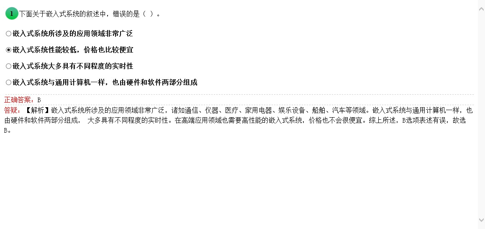
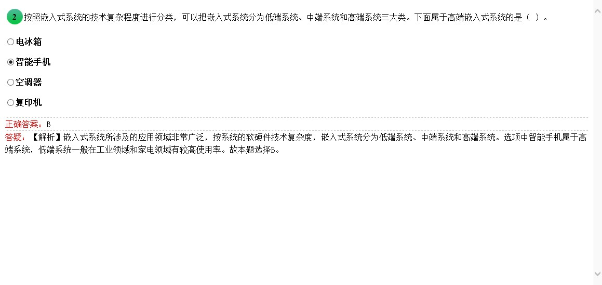
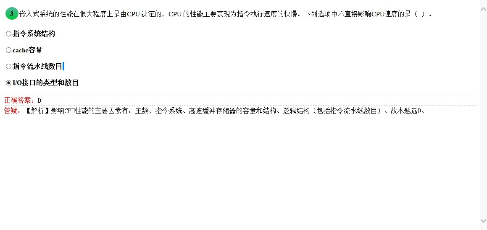
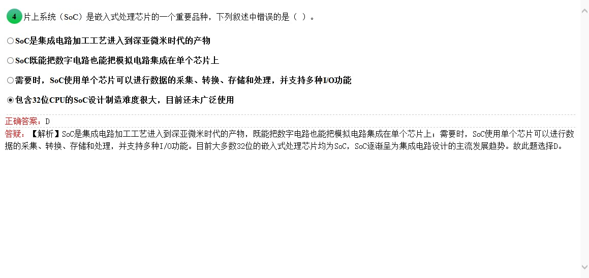
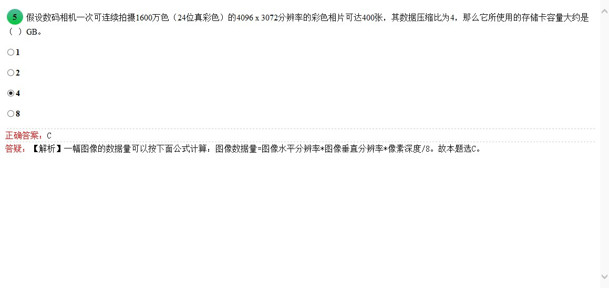
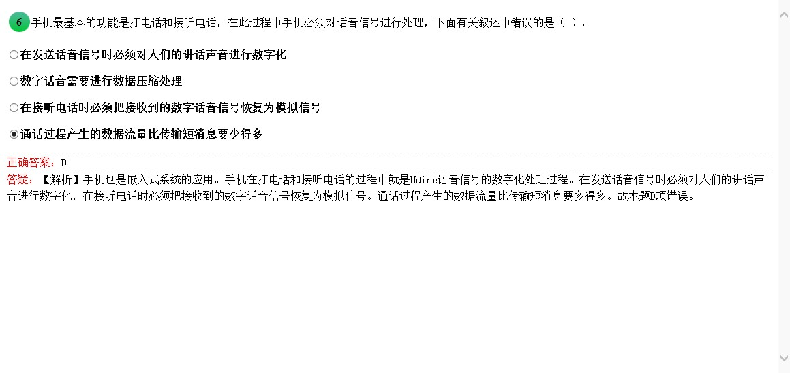
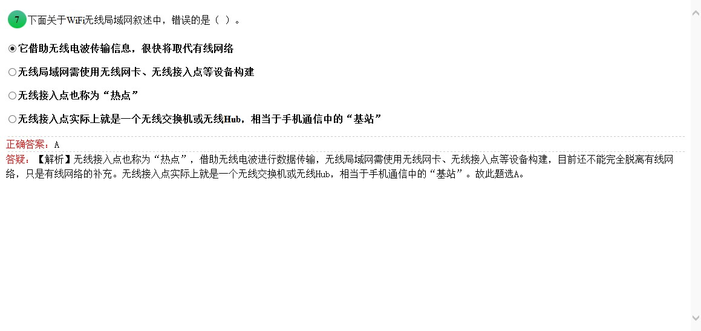

<!-- more -->

# 1 填空题

## 1.1 系统的叙述中，错误的是

> 嵌入式也有高性能芯片

## 1.2 属于高端嵌入式系统的是

> 手机当然是嵌入式高端的扛把子

## 1.3 不直接影响CPU速度的是

> 影响CPU性能的主要因素有:主频 指令系统 高速缓冲存储器的容量和结构 逻辑结构

## 1.4 SOC 叙述的错误是

> 32位早有了。。。送分题

## 1.5 存储卡容量大约是_GB

> 卧槽不会。。。无耻看下答案进行计算试下  图像数据量=4096*3072*24/8/4=9437184B  一共400张这样的数据
那就是9437184*400/1024/1024/1024=3.515625 G 数据 所以选C 需要4G 数据 [参考链接](http://it.da-quan.net/article.php?id=1819461994146910068)

## 1.6 手机电话叙述错误的是

> 不吐槽，不解释

## 1.7 WIFI叙述错误的是

> 不吐槽，不解释