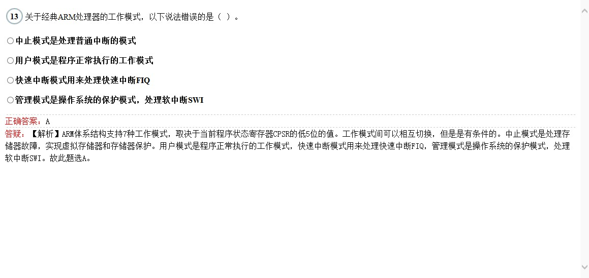
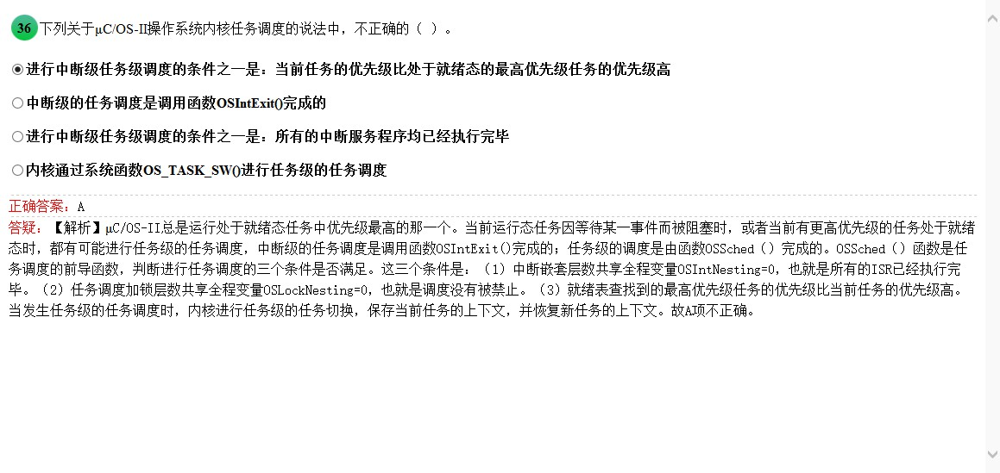

<!-- more -->

# 1 选择题

## 1.1 


> 嵌入式也有高性能芯片

## 1.2


> 手机当然是嵌入式高端的扛把子

## 1.3


> 影响CPU性能的主要因素有:主频 指令系统 高速缓冲存储器的容量和结构 逻辑结构

## 1.4


> 32位早有了。。。送分题

## 1.5


> 卧槽不会。。。无耻看下答案进行计算试下 图像数据量=  ``` 4096*3072*24/8/4=9437184B ```
一共400张这样的数据,那就是``` 9437184*400/1024/1024/1024=3.515625 G ```数据 所以选C 需要4G 数据 [参考链接](http://it.da-quan.net/article.php?id=1819461994146910068)

## 1.6


> 不吐槽，不解释

## 1.7


> 不吐槽，不解释

## 1.8


> 取代你妹啊

## 1.9


> 记住就好了

## 1.10


> 当然是 m0最便宜了

## 1.11


> cortex处理器分A R M三类，名称分别是

cortex | description 
----|------
A | 应用型cortex处理器
R | 嵌入式Cortex处理器 
M | 嵌入式Cortex处理器

## 1.12


> ARM9 属于ARM v4T架构 详见**书第51页**介绍arm处理器架构的发展

## 1.13


> 懵逼了，[百度之](https://zhidao.baidu.com/question/481828869.html)，[CPSR(程序状态寄存器) 构成](http://blog.csdn.net/laviolette/article/details/51376751)
从编程的角度看，ARM微处理器的工作状态一般有两种，并可在两种状态之间切换： 
－ 第一种为ARM状态，此时处理器执行32位的字对齐的ARM指令； 
－ 第二种为Thumb状态，此时处理器执行16位的、半字对齐的Thumb指令。 
 工作模式有:
（1）用户模式（usr , User Mode）。ARM处理器正常的程序执行状态。
（2）快速中断模式（fiq , Fast Interrupt Request Mode）。用于高速数据传输或通道处理。当触发快速中断时进入此模式。
（3）外部中断模式 ( irq , Interrupt Request Mode )。用于通用的中断处理。当触发外部中断时进入此模式。
（4）管理模式 ( svc , Supervisor Mode )。操作系统使用的保护模式。在系统复位或者执行软件中断指令SWI时进入。
（5）数据访问终止模式 ( abt , Abort Mode )。当数据或指令预取终止时进入该模式，可用于虚拟存储及存储保护。
（6）系统模式（sys , System Mode ）。运行具有特权的操作系统任务。
（7）未定义指令中止模式 ( und , Undefined Mode )。当未定义的指令执行时进入该模式，可用于支持硬件协处理器的软件仿真。

## 1.14


>参考上一题

## 1.15


>[参考](http://blog.csdn.net/u013477200/article/details/50723555)，详见**书第73页**
LDRH R1,[R2,#4]  ;将存储器地址为R2＋4的半字数据读入寄存器R1，并将R1的高16位清零。 R1 再自增4

## 1.16


>详见**书第76页**

## 1.17


>详见书第68页开始的汇编指令集

## 1.18


>一脸懵逼

## 1.19


> JTAG 具有在线编程功能

## 1.20


> 选择高速接线

## 1.21


>和位数有关的，分辨率

## 1.22


>大容量是NAND FLASH ，NOR flash 最大 大概是 128Mbit

## 1.23


>SPI 可以支持 多主多从

## 1.24


>不解释

## 1.25


>共阳接发 ， 0点亮 1 不点亮

## 1.26


>哈哈 USB是半双工。。。

## 1.27


>**参考书 P177** **UBDIV=INT(UCLK/(波特率*16))-1=(100MHZ/（19200*16）*16)-1=INT(325.52)-1=324**

## 1.28


> 应该是小于等于8个字节，CANFD 是小于等于64个字节，说的太绝对的话一定有问题

## 1.29


>卧槽，时间片轮转不是实时系统必备的，学习了

## 1.30


>两个都不是同一个概念。。。

## 1.31


>没有UBOOT叼

## 1.32


>linux不主要包括shell

## 1.33


>**参考书P245**

## 1.34


>**参考书P245**

## 1.35


>都服务了，还挂起什么。。。

## 1.36


>不解释

## 1.37


>不会立即

## 1.38


>不会立即

## 1.39


>仿真器被排除了。。。

## 1.40


>RVDS包含指令集仿真器

# 2 填空题

## 2.41_42


>[SIMD](https://baike.baidu.com/item/SIMD/3412835?fr=aladdin)

## 2.43_44


>不解释

## 2.45_46


>送分题

## 2.47_48


>卧槽，不知道啊。。。

## 2.49_50


>[CPU流水线](https://baike.baidu.com/item/cpu%E6%B5%81%E6%B0%B4%E7%BA%BF/4421101?fr=aladdin)

## 2.51_52


>RSBS R2,R1,R0 ;R2=R1-R0=>0x67000010-0x67000000=0x10    ORR R3,R1,R0 ;R3=R1|R0=0x67000010

## 2.53_54


>R1=R0  R2=R0+4

## 2.55_56


>R0=R1+4 R1=R1+4

## 2.57_58


>如图所示 **书P109**

## 2.59_60


>如图所示 **书P109**

## 2.61_62


>如图所示 **书P115**

## 2.63_64


>**2^26*8b/8/1024/1024=64 MB    2^26*8=2^条数 *16   条数=25**

## 2.65_66


>如图所示 **书P142**

## 2.67_68


>如图所示

## 2.69_70


>如图所示

## 2.71_72


>如图所示，大小写要小心。。。

## 2.73_74


>如图所示 **书P223**

## 2.75_76


>如图所示

## 2.77_78


>如图所示 **书P154**

## 2.79_80


>如图所示 **书P293**


# 3 综合题


>所有答案


