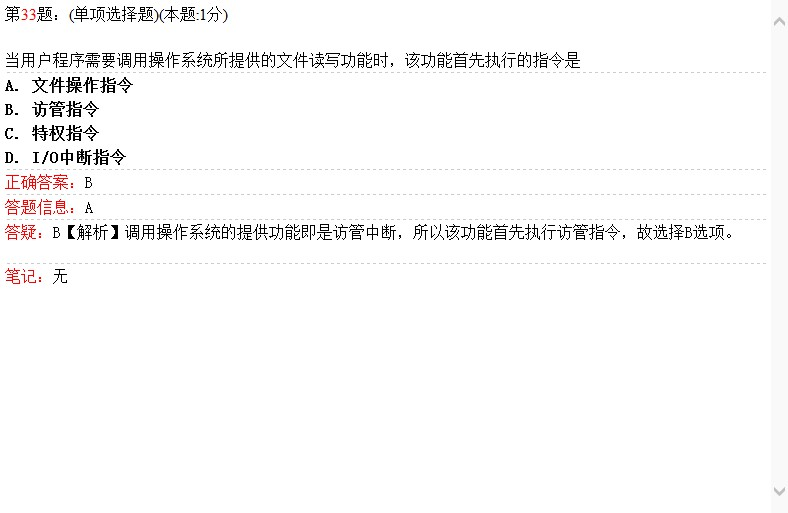
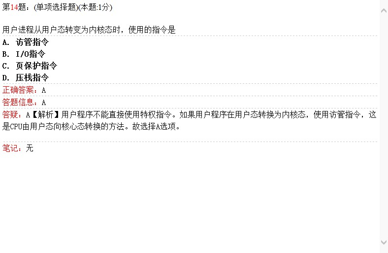
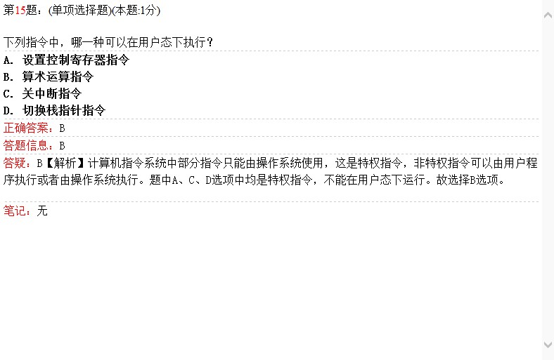
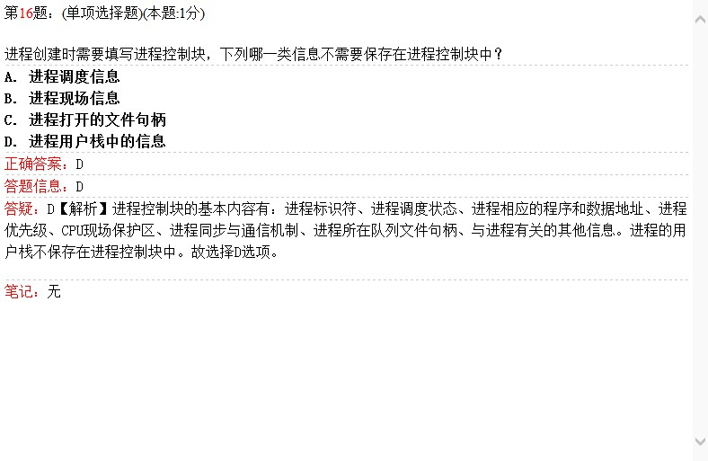
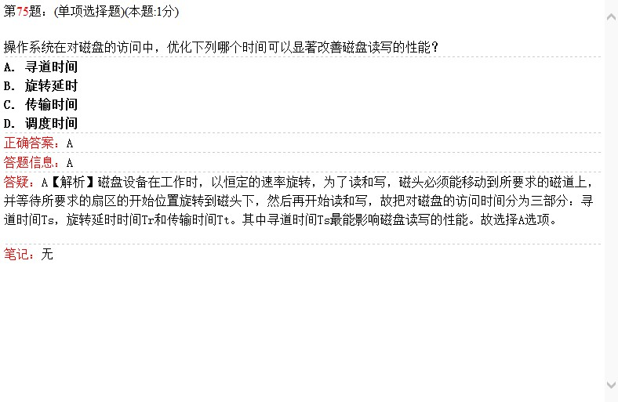
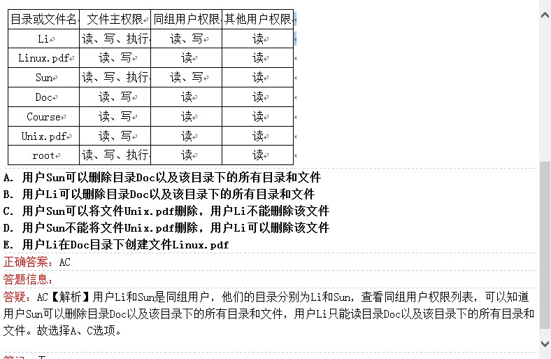
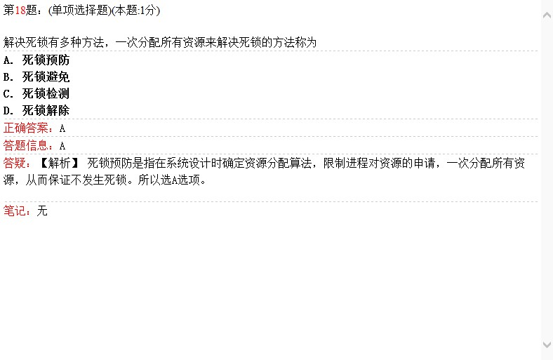
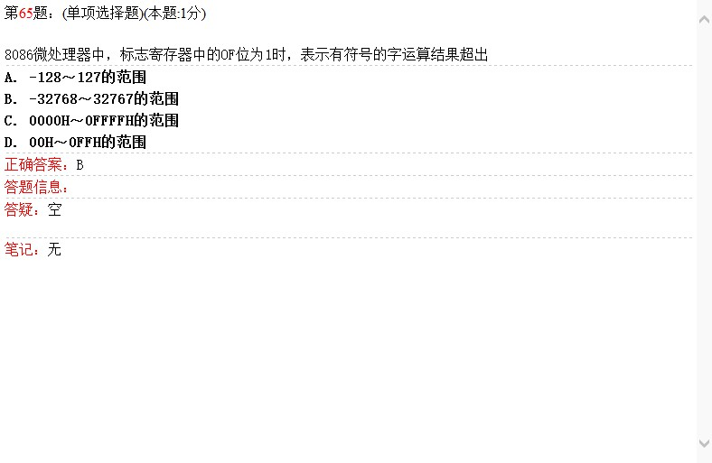
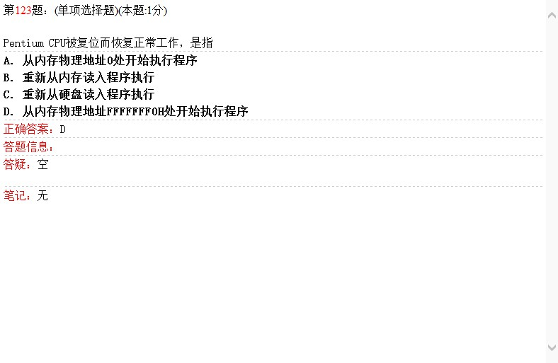
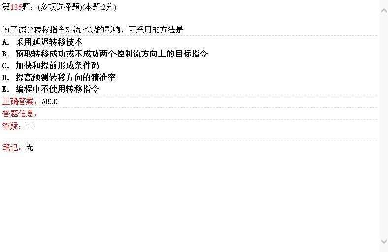

<!-- more -->

> 注:未来教育四级嵌入式真考题库，参考书籍
> - 1.<< 全国计算机等级考试四级教程 -操作系统原理(2018版)>>[简称:**原理书**]
> 
> - 2.<< 全国计算机等级考试四级教程 -计算机组成与接口(2018版)>>[简称:**接口书**]

# 1.操作系统

## 1.1 操作系统理论

### 1.1.1

  
> 参考原理书 P21 - P24 

### 1.1.2

> 排除法子做的，原理书中P6和答案介绍的有点不一样

### 1.1.3

> 原理书P3介绍 操作系统特征只有
>  - 1. 并发性
>  - 2. 共享性
>  - 3. 随机性

### 1.1.4

> 不解释

### 1.1.5

> 及，要看清这个字

### 1.1.6

> 不解释 原理书P1 介绍

### 1.1.7

> 不解释 原理书P1 介绍

### 1.1.8

> 不解释 原理书P1 介绍

### 1.1.9

> 不解释 原理书P1 介绍

### 1.1.10

> 支撑软件和软件系统区别。支撑软件是软件最低的，比如微软.net

### 1.1.11

> 不解释

### 1.1.12

> 不解释

### 1.1.13

> FUCK,A 和 B答案一样来着

### 1.1.14

> 貌似答案D也是缺点来着

### 1.1.15

> C/S 模式

### 1.1.16

> 原理书 P6-P9 有进程管理，存储管理，文件管理，设备管理

### 1.1.17

> 原理书 P6-P9 有进程管理，存储管理，文件管理，设备管理

### 1.1.18

> 原理书 P6-P9 有进程管理，存储管理，文件管理，设备管理

### 1.1.19

> 其它说的太绝对了

### 1.1.20

> 原理书P4

### 1.1.21

> 这道题有陷阱，可以共享，但不是共享设备，审题不清，很容易被带歪

### 1.1.22

> 不解释

### 1.1.23

> 可重如代码当然可以共享

### 1.1.24

> 不解释

### 1.1.25

> 不解释

### 1.1.26

> 不解释

### 1.1.27

> 不解释

### 1.1.28

> 不解释

### 1.1.29

> 不解释

### 1.1.30

> 不解释

### 1.1.31

> 擦，是**write**,不是我大printf

### 1.1.32

> 不解释，死记

### 1.1.33

> 额，访管你妹啊，FUCK，from 百度知道:用户程序中凡是要调用操作系统功能时就安排一条访管指令

### 1.1.34

> 核心态（管态） 和 用户态（目态）

### 1.1.35

> 不解释

### 1.1.36

> 不解释

### 1.1.37

> 不解释

### 1.1.38

> 不解释

### 1.1.39

> 不解释

### 1.1.40

> 不解释

### 1.1.41

> 不解释

### 1.1.42

> 不解释

### 1.1.43

> 不解释

### 1.1.44

> 不解释

### 1.1.45

> 不解释

## 1.2 操作系统运行机制

### 1.2.1

  
> 不解释

### 1.2.2

  
> 不解释

### 1.2.3

  
> 指令错不属于I/O中断事件

### 1.2.4

  
> 操作系统提供3钟接口供用户使用，命令接口 程序接口 和图形界面接口

### 1.2.5

  
> 用户态 - >核心态 都需要发起访管中断

### 1.2.6

  
> 中断向量表不解释

### 1.2.7

  
> 中断请求

### 1.2.8

  
> 是异常

### 1.2.9

  
> 中断事件

### 1.2.10

  
> 不解释

### 1.2.11

  
> 妈蛋，重复了(#`O′)，过分了

### 1.2.12

  
> 系统调用

### 1.2.13

  
> 同上

### 1.2.14

  
> 访管指令

### 1.2.15

  
> 算术运算指令

### 1.2.16

  
> 不解释

### 1.2.17

  
> 递归无法实现

### 1.2.18

  
> 文件操作

### 1.2.19

  
> 不能够通过变量传递

### 1.2.20

  
> 用户态调用核心态称为系统调用

### 1.2.21

  
> 过分了(#`O′)，又又重复了

### 1.2.22

  
> 过分了(#`O′)，又又又重复了

### 1.2.23

  
> 不解释

### 1.2.24

  
> 不解释

### 1.2.25

  
> 不解释

### 1.2.26

  
> 不解释

### 1.2.27

  
> 重复了

### 1.2.28

  
> 妈蛋,重复了

### 1.2.29

  
> 不解释

### 1.2.30

  
> 不解释

### 1.2.31

  
> 不解释

### 1.2.32

  
> 不解释

### 1.2.33

  
> 不解释

### 1.2.34

  
> 卧槽，重复了

### 1.2.35

  
> 卧槽，重复了

## 1.3 进程线程模型

### 1.3.1

> 并发是微观，并行是宏观

### 1.3.2

> 中断程序不用进程管理

### 1.3.3

> 中断程序不用进程管理

### 1.3.3

> 不解释
 
### 1.3.4

> 屏蔽中断
 
### 1.3.5

> 程序性中断
 
### 1.3.6

> 重复了
 
### 1.3.7

> 考虑到最坏情况
 
### 1.3.8

> fork不是fuck...
 
### 1.3.9

> 这么快就重复了么？
 
### 1.3.10

> PCB
 
### 1.3.11

> 还是PCB
 
### 1.3.12

> 还还是PCB
 
### 1.3.13

> 不解释
 
### 1.3.14

> 不确定性
 
### 1.3.15

> 总之PCB就对了
 
### 1.3.16

> 堆栈信息不包含
 
### 1.3.17

> 不解释，没听过，参考原理书 P53 - P55
 
### 1.3.18

> 当前状态
 
### 1.3.19

> 不解释                          
 
### 1.3.20

> 不解释
 
### 1.3.21

> 不解释
 
### 1.3.22

> 不解释
 
### 1.3.23

> 没有安全状态 ，[参考](https://blog.csdn.net/hufanhl/article/details/52314030)
 
### 1.3.24

> 不解释
 
### 1.3.25

> 不解释
 
### 1.3.26

> 不解释
 
### 1.3.27

> 不解释
 
### 1.3.28

> 单核单进程
 
### 1.3.29

> 和上一题不是重复来着，问的是最少几个，最少0个
 
### 1.3.30

> 肯定有一个在运行，处于就绪就有19个
 
### 1.3.31

> 最少 0 个 就绪
 
### 1.3.32

> 全部堵死

 ### 1.3.33

> 4核心4进程
 
### 1.3.34

> 不解释
 
### 1.3.35

> 不解释
 
### 1.3.36

> 不解释
 
### 1.3.37

> 不解释
 
### 1.3.38

> 不解释
 
### 1.3.39

> PCB 不解释
 
### 1.3.40

> 创建好后任务在就绪队列
 
### 1.3.41

> 不解释
 
### 1.3.42

> 不解释
 
### 1.3.43

> 重复了，我了个大草
 
### 1.3.44

> 这个是创建
 
### 1.3.45

> 调用经常控制源语实现
 
### 1.3.46

> 挂起线程
 
### 1.3.47

> 阻塞了，别人才有机会运行
 
### 1.3.48

> 不解释
 
### 1.3.49

> 重复了，卧槽
 
### 1.3.50

> 重复了。。。
 
### 1.3.51

> 不解释。重复了
 
### 1.3.52

> 不解释
 
### 1.3.53

> 不解释
 
### 1.3.54

> 不解释
 
### 1.3.55

> 原理同上一题
 
### 1.3.56

> 2^3次方
 
### 1.3.57

> 1+2+4+8 = 15
 
### 1.3.58

> 原理书P58
 
### 1.3.59

> 1+2 = 3
 
### 1.3.60

> 1+4 = 5
 
### 1.3.61

> 1+8 = 9
 
### 1.3.62

> 1+2+4 = 7
 
### 1.3.63

> 不解释
 
### 1.3.64

> 选D，1+8 =9
 
### 1.3.65

> 选B 1+2+4 = 7
 
### 1.3.66

> 不解释.重复了
 
### 1.3.67

> 就绪到运行不会引起CPU调用
 
### 1.3.68

> 不解释
 
### 1.3.69

> 不解释
 
### 1.3.70

> 不解释
 
### 1.3.71

> pthread_create的返回值 表示成功，返回0；表示出错，返回表示-1。[参考](https://baike.baidu.com/item/pthread_create/5139072?fr=aladdin)，选A
 
### 1.3.72

> 有join,等待特定线程退出选B
 
### 1.3.73

> yeild 等待退出选C
 
### 1.3.74

> 直接退出 选D 
 
### 1.3.75

>一个主线程和一个创建的线程，总共2个线程
 
### 1.3.76

> 不解释，第三个参数是函数起始地址，也是线程名
 
### 1.3.77

> 选D
 
### 1.3.78

>和1.3.75重复了选B
 
### 1.3.79

> 不解释，重复了
 
### 1.3.80

> 不解释，缓冲区
 
### 1.3.81

> 重复的太明显了吧

### 1.3.82

> 不解释，互相竞争
 
### 1.3.83

> 地址越界
 
### 1.3.84

> 重复的太大胆了
 
### 1.3.85

> 不可重用
 
### 1.3.86

> 选择ABE，保存在进程控制块
 
### 1.3.87

> 选ACD
 
### 1.3.88

> 同1.3.36
 
### 1.3.89

> 设备分配时候不是
 
### 1.3.90

> BCE
 
### 1.3.91

> 放入就绪队列。选择ABC
 
### 1.3.92

> ABC，就绪，运行，阻塞
 
### 1.3.93

> ABC，独立随机共享
 
### 1.3.94

> ABC
 
### 1.3.95

> 不解ABC
 
### 1.3.96

> 用户，内核，混合
 
### 1.3.97

> 重复了，不解释
 
### 1.3.98

> 重复了
 
### 1.3.99

> 线程没有独立的地址空间
 
### 1.3.100

> ABCD 高优先级不是
 
### 1.3.101

> A和E明显不对啊
 
### 1.3.102

> E不是主要功能蛤？
 
### 1.3.103

> 全中
 
### 1.3.104

> 分为 计算密集型，和I/O密集型
 
### 1.3.105

> 明目张胆重复啊
 
### 1.3.106

> 不解释
 
## 1.4 并发与同步
 
### 1.4.1

> 并发性
 
### 1.4.2

> CPU和外部设备可以并行
 
### 1.4.3

> 不解释
 
### 1.4.4

> 创建线程就进入就绪，法引起调度
 
### 1.4.5

> 管程序 保证本身互斥
 
### 1.4.6

> 不解释
 
### 1.4.7

> 同步
 
### 1.4.8

> PV不饿能做大量进程间信息交换
 
### 1.4.9

> 同步关系
 
### 1.4.10

> 临界区
 
### 1.4.11

> 不能无限等待
 
### 1.4.12

> 互斥
 
### 1.4.13

> 同步
 
### 1.4.14

> 飞机票是访问资源，所以是临界资源
 
### 1.4.15

> 互斥关系
 
### 1.4.16

> 不解释，原理书P79
 
### 1.4.17

> 自己本身实现
 
### 1.4.18

> 1-(1+k) = -k
 
### 1.4.19

> P 操作 是减去1 ，V操作是增加1
 
### 1.4.20

> 已满的不好申请
 
### 1.4.21

> 共享内存
 
### 1.4.22

> 加减操作
 
### 1.4.23

> 不解释
 
### 1.4.24

> 进入区
 
### 1.4.25

> 退出区
 
### 1.4.26

> 不解释
 
### 1.4.27

> 不解释
 
### 1.4.28

> 不解释
 
### 1.4.29

> 选A，进入临界区
 
### 1.4.30

> 重复了，我擦
 
### 1.4.31

> 同步关系
 
### 1.4.32

> 不解释
 
### 1.4.33

> 有可能
 
### 1.4.34

> 只能解决，话绝对
 
### 1.4.35

> 不支持插队
 
### 1.4.36

> 不解释
 
### 1.4.37

> 共享内存不需要产生备份
 
### 1.4.38

> 不解释
 
### 1.4.39

> 不解释
 
### 1.4.40

> 消息机制
 
### 1.4.41

> 管道通信，通过连接两个进程打开的共享文件
 
### 1.4.42

> 不解释
 
### 1.4.43

> 由本身特性决定
 
### 1.4.44

> 共享内存需要解决互斥问题
 
### 1.4.45

> 同步是管道通信
 
### 1.4.46

> 重复了
 
### 1.4.47

> 重复了
 
### 1.4.48

> 可变分区
 
### 1.4.49

> ABC
 
### 1.4.50

> 额，和上一题重复了
 
### 1.4.51

> 创建线程或者唤醒进入就绪队列都不唤醒
 
### 1.4.52

> CD
 
### 1.4.53

> ADE是错的
 
### 1.4.54

> ABC
 
### 1.4.55

> 共享数据结构和一组操作过程
 
### 1.4.56

> ABD，C答案应该执行P操作，E答案说只能太否定了
 
### 1.4.57

> 没有平等问题
 
### 1.4.58

> ABC
 
### 1.4.59

> 没有互斥等待说法
 
### 1.4.60

> 分派器是调度策略
 
### 1.4.61

> AB
 
### 1.4.62

> ABCD
 
### 1.4.63

> 重复了，ABCD
 
### 1.4.64

> AB
 
### 1.4.65

> ABCD
 
## 1.5 内存管理
 
### 1.5.1

> D 虚拟页式 ，动态扩充内存
 
### 1.5.2

> 每一条指令执行时刻
 
### 1.5.3

> 内存紧缩
 
### 1.5.4

> 部分装入内存
 
### 1.5.5

> 不解释
 
### 1.5.6

> 可变分区
 
### 1.5.7

> 动态重定位
 
### 1.5.8

> 静态重定位
 
### 1.5.9

> 重定位
 
### 1.5.10

> 选A
 
### 1.5.11

> 重复了
 
### 1.5.12

> 下邻区空闲
 
### 1.5.13

> 空闲区大小递增
 
### 1.5.14

> 页式分配
 
### 1.5.15

> 104 M 答案错了
 
### 1.5.16

> 首次适应算法
 
### 1.5.17

> 选B
 
### 1.5.18

> 先进先出算法
 
### 1.5.19

> 不解释
 
### 1.5.20

> 最近不常用页面置换算法
 
### 1.5.21

> 选D
 
### 1.5.22

> 不解释
 
### 1.5.23

> 选A
 
### 1.5.24

> 选D 
 
### 1.5.25

> 第二次
 
### 1.5.26

> 不解释
 
### 1.5.27

> 不解释
 
### 1.5.28

> 送分
 
### 1.5.29

> 0.4+0.4*0.1=0.44us
 
### 1.5.30

> 三次
 
### 1.5.31

> 系统效率提高，增加进程量
 
### 1.5.32

> 减轻CPU进程数，总之系统利用率高，增加进程，系统利用率低，减少进程
 
### 1.5.33

> C
 
### 1.5.34

> 2^10
 
### 1.5.35

> 不解释
 
### 1.5.36

> 不解释
 
### 1.5.37

> 不解释
 
### 1.5.38

> 不解释
 
### 1.5.39

> 不解释
 
### 1.5.40

> 不解释
 
### 1.5.41

> 不解释
 
### 1.5.42

> 不解释
 
### 1.5.43

> 不解释
 
### 1.5.44

> 没写的权限
 
### 1.5.45

> 73%
 
### 1.5.46

> 不解释
 
### 1.5.47

> 不解释，上题比较下
 
### 1.5.48

> 硬件完成
 
### 1.5.49

> 页号地址高部分，业内地址是低位部分
 
### 1.5.50

> 不解释
 
### 1.5.51

> 后台执行
 
### 1.5.52

> 不解释
 
### 1.5.53

> 不解释
 
### 1.5.54

> 不解释
 
### 1.5.55

> 不解释
 
### 1.5.56

> 不解释
 
### 1.5.57

> 分配不合理
 
### 1.5.58

> 不解释
 
### 1.5.59

> 不解释
 
### 1.5.60

> 不解释
 
### 1.5.61

> 缺页中断
 
### 1.5.62

> 不解释
 
### 1.5.63

> 100
 
### 1.5.64

> 50次
 
### 1.5.65

> 不解释
 
### 1.5.66

> 不解释
 
### 1.5.67

> 200
 
### 1.5.68

> 不解释
 
### 1.5.69

> 选C
 
### 1.5.70

> 不解释
 
### 1.5.71

> 不解释
 
### 1.5.72

> 不解释
 
### 1.5.73

> 不解释
 
### 1.5.74

> 文件调入
 
### 1.5.75

> 不解释
 
### 1.5.76

> 不解释
 
### 1.5.77

> 不解释
 
### 1.5.78

> 最差适配。10K和5K和20K和25K
 
### 1.5.79

> 最佳适配。30K 和25K
 
### 1.5.80

> 首次适配。5K和25K和25K
 
### 1.5.81

> 下次适配 30K 5K和25K 和25K
 
### 1.5.82

> 最佳适配 30K 和25K
 
### 1.5.83

> 首次适配 5K 5K 5K 26K
 
### 1.5.84

> 下次适配 30K 5K和25K 
 
### 1.5.85

> 最佳适配 30K 和25K
 
### 1.5.86

> 首次适配 5K 5K 5K 26K
 
### 1.5.87

> 物理结构和存放文件的设备物理特性
 
### 1.5.88

> ACDE
 
### 1.5.89

> 动态分区和段式
 
### 1.5.90

> 可变分区和固定分区不是
 
### 1.5.91

> 空闲块链表，位示图，空闲页表
 
### 1.5.92

> C 单一分区不是
 
### 1.5.93

> 没有越界中断 ABCE
 
### 1.5.94

> AB 固定分区和可变分区
 
### 1.5.95

> 虚拟页式和虚拟段式  CD
 
### 1.5.96

> 固定分区和可变分区 DE
 
### 1.5.97

> ACE 空闲区表 页表 位图
 
### 1.5.98

> ADE
 
### 1.5.99

> BD段式和可变分区
 
### 1.5.100

> ACE 空闲区表 页表 位图
 
### 1.5.101

> ADE
 
### 1.5.102

> BD 段式和可变分区
 
### 1.5.103

> ACDE 快表是页表的一部分
 
### 1.5.104

> ABCE 磁盘始地址不一定有
 
### 1.5.105

> CDE 
 
### 1.5.106

> ABCD
 
### 1.5.107

> 有效修改和访问
 
### 1.5.108

> CDE
 
### 1.5.109

> AB
 
### 1.5.110

> 访问和修改位CD
 
### 1.5.111

> 工作集会动态变化
 
### 1.5.112

> ABCD，缺页率上升
 
### 1.5.113

> BCD，FIFO导致 Belady现象。不是很显著
 
### 1.5.114

> AB 请求调页和预调页
 
### 1.5.115

> ABCD
 
### 1.5.116

> BCD
 
### 1.5.117

> AB 请求调页和预调页
 
### 1.5.118

> ABCD 空闲块表，空闲块链表，位示图，成组链接法
 
## 1.6 文件管理
 
### 1.6.1

> 顺序结构
 
### 1.6.2

> 数据块 A
 
### 1.6.3

> A文件名
 
### 1.6.4

> A按名存取
 
### 1.6.5

> A解决文件重名问题
 
### 1.6.6

> A顺序
 
### 1.6.7

> B链接结构
 
### 1.6.8

> C 索引结构
 
### 1.6.9

> 顺序结构
 
### 1.6.10

> B链式存取慢
 
### 1.6.11

> A 构成文件的内容基本单位称为信息项
 
### 1.6.12

> A 顺序结构
 
### 1.6.13

> B链式
 
### 1.6.14

> 不解释
 
### 1.6.15

> A
 
### 1.6.16

> A 限制子目录个数
 
### 1.6.17

> A文件控制块
 
### 1.6.18

> 流式和记录A
 
### 1.6.19

> 索引结构选B 顺序链式索引
 
### 1.6.20

> A顺序
 
### 1.6.21

> B索引结构
 
### 1.6.22

> A文件控制块
 
### 1.6.23

> C加快检索速度

### 1.6.24

> A 由操作系统绝对如何设置当前工作目录错的
 
### 1.6.25

> A
 
### 1.6.26

> C文件描述符
 
### 1.6.27

> 不解释
 
### 1.6.28

> 不解释
 
### 1.6.29

> 不解释
 
### 1.6.30

> 文件描述符
 
### 1.6.31

> A 打开没有填写读写方式
 
### 1.6.32

> A 增量转储
 
### 1.6.33

> A 将文件控制块（FCB） 读入内存
 
### 1.6.34

> B 关闭是磁盘或缓存
 
### 1.6.35

> D 624
 
### 1.6.36

> B 物理结构
 
### 1.6.37

> B 用户对文件的存取方式
 
### 1.6.38

> A 顺序结构
 
### 1.6.39

> C 数据传输
 
### 1.6.40

> C 读状态->置数据->置地址->置控制->再读状态
 
### 1.6.41

> D 创建不需要
 
### 1.6.42

> C 数据传输
 
### 1.6.43

> C 读状态->置数据->置地址->置控制->再读状态
 
### 1.6.44

> D 创建不需要
 
### 1.6.45

> A 8%
 
### 1.6.46

> 不解释
 
### 1.6.47

> 选A
 
### 1.6.48

> SSTF 饥饿
 
### 1.6.49

> 优化设备分配方案
 
### 1.6.50

> B
 
### 1.6.51

> 不解释
 
### 1.6.52

> 距离越近越好选B
 
### 1.6.53

> 同上一题，和上上一题不一样，这个是向减少的方向移动
 
### 1.6.54

> 选C
 
### 1.6.55

> 选D
 
### 1.6.56

> 选B
 
### 1.6.57

> 选C
 
### 1.6.58

> 不解释
 
### 1.6.59

> 不解释
 
### 1.6.60

> 不解释
 
### 1.6.61

> A 2次
 
### 1.6.62

> A 成组合链法
 
### 1.6.63

> A 文件描述符
 
### 1.6.64

> 没有简化目录管理
 
### 1.6.65

> 选B，用户无法创建根目录
 
### 1.6.66

> 选C
 
### 1.6.67

> 都选C 
 
### 1.6.68

> 选C
 
### 1.6.69

> 还是选C
 
### 1.6.70

> 都选C
 
### 1.6.71

> 选A了
 
### 1.6.72

> 选C
 
### 1.6.73

> 还是选C
 
### 1.6.74

> 不解释
 
### 1.6.75

> 寻道时间
 
### 1.6.76

> 不解释
 
### 1.6.77

> 想多了
 
### 1.6.78

> 选B 
 
### 1.6.79

> 选A
 
### 1.6.80

>  。。。
 
### 1.6.81

> 不解释
 
### 1.6.82

> 不解释
 
### 1.6.83

> B
 
### 1.6.84

> 不解释
 
### 1.6.85

> 不解释
 
### 1.6.86

> 不解释
 
### 1.6.87

> 不解释
 
### 1.6.88

> 不解释
 
### 1.6.89

> D 逻辑设备和物理设备之间的对应关系
 
### 1.6.90

> C 中断方式
 
### 1.6.91

> 没有文件描述符
 
### 1.6.92

> AB 为了安全  1 建立副本  2 定时存储 3 规定文件的存取权限
 
### 1.6.93

> ADE 连续和随机
 
### 1.6.94

> ABC 存取控制矩阵 用户权限表 口令或密码
 
### 1.6.95

> ABCD 没有文件访问控制列表
 
### 1.6.96

> BDE 组织形式划分 普通 目录 特殊
 
### 1.6.97

> AD  用途划分 系统文件和用户文件
 
### 1.6.98

> CE 保护方式划分 只读文件和可执行文件，读写文件，不保护文件
 
### 1.6.99

> BCE 临时 永久 档案
 
### 1.6.100

> ACE 顺序 链接 索引
 
### 1.6.101

> ABDE 链接结构，随机存取不支持
 
### 1.6.102

> BCE    
 
### 1.6.103

> 不解释
 
### 1.6.104

> 链式结构随机存取不适合
 
### 1.6.105

> ABC 块高速缓存，磁盘驱动调度和目录项分解法
 
### 1.6.106

> ABCE  只支撑8个字节的空间
 
### 1.6.107

> CD 链接到 SUN目录下，原文件名或新文件名
 
### 1.6.108

> AC
 
### 1.6.109

> BCD
 
### 1.6.110

> 不解释
 
### 1.6.111

> 不解释
 
### 1.6.112

> 不解释
 
### 1.6.113

> 不解释
 
### 1.6.114

> 不解释
 
### 1.6.115

> 不解释
 
### 1.6.116

> 不解释
 
### 1.6.117

> 不解释
 
### 1.6.118

> 不解释
 
### 1.6.119

> 不解释
 
## 1.7 I/O设备管理
 
### 1.7.1

> 调度时间不在里面 D
 
### 1.7.2

> 块设备和字符设备
 
### 1.7.3

> A 块设备
 
### 1.7.4

> B 字符设备
 
### 1.7.5

> A DMA方式
 
### 1.7.6

> A 方便用户使用

### 1.7.7

> A 通过缓冲技术匹配高，低速设备
 
### 1.7.8

> A 提高并发速度

### 1.7.9

> A 通过协调避免冲突
 
### 1.7.10

> A 提高统一接口
 
### 1.7.11

> 缓存匹配高速和低速设备
 
### 1.7.12

> A 通过协调避免冲突
 
### 1.7.13

> A
 
### 1.7.14

> A
 
### 1.7.15

> D 缓存
 
### 1.7.16

> 同步
 
### 1.7.17

> 设备独立层
 
### 1.7.18

> B 匹配不同外部设备的传输速度
 
### 1.7.19

> B 系统 设备 控制
 
### 1.7.20

> A 程序直接控制方式
 
### 1.7.21

> B 中断控制方式
 
### 1.7.22

> C
 
### 1.7.23

> D 通道控制方式

### 1.7.24

> 没有顺序通道

### 1.7.25

> A 程序直接控制方式
 
### 1.7.26

> D 通道控制方式
 
### 1.7.27

> 不解释
 
### 1.7.28

> 不解释
 
### 1.7.29

> 不解释
 
### 1.7.30

> A 
 
### 1.7.31

> D 高速缓存 不是自动的
 
### 1.7.32

> A
 
### 1.7.33

> A
 
### 1.7.34

> 不解释
 
### 1.7.35

> B 不可重用资源
 
### 1.7.36

> 可能死锁
 
### 1.7.37

> ACDE 没有设备控制
 
### 1.7.38

> 没有E设备执行层
 
### 1.7.39

> AE
 
### 1.7.40

> ABCD 没有及时性
 
### 1.7.41

> ABC 字节 数据 数组

### 1.7.42

> ABC
 
### 1.7.43

> BCD 设备器和接口部件  设备控制器   设备硬件
 
### 1.7.44

> ABCD  系统不包含硬件
 
### 1.7.45

> ABCD 没有级联和堆叠技术
 
### 1.7.46

> 不解释 ABCD 没有设备分配表
 
### 1.7.47

> AB 先来先服务 高优先级优先
 
### 1.7.48

> AB 硬盘和磁带机
 
### 1.7.49

> 不解释
 
### 1.7.50

> AB
 
### 1.7.51

> 不解释
 
## 1.8 死锁
 
### 1.8.1

> A
 
### 1.8.2

> D 进程推进顺序不当
 
### 1.8.3

> D 优先级太低，会饿死
 
### 1.8.4

> A 进入阻塞 且无法唤醒
 
### 1.8.5

> 不解释
 
### 1.8.6

> C没有阻塞，但是被无视
 
### 1.8.7

> A
 
### 1.8.8

> 不解释
 
### 1.8.9

> 不解释
 
### 1.8.10

> C
 
### 1.8.11

> A
 
### 1.8.12

> B
 
### 1.8.13

> B 3台
 
### 1.8.14

> A 死锁预防
 
### 1.8.15

> 额，A和B一样子的
 
### 1.8.16

> 死锁检测
 
### 1.8.17

> D 死锁解除
 
### 1.8.18

> A 死锁预防
 
### 1.8.19

> C 不满足
 
### 1.8.20

> D 死锁解除
 
### 1.8.21

> 不解释
 
### 1.8.22

> 不解释
 
### 1.8.23

> 不解释
 
### 1.8.24

> C
 
### 1.8.25

> A
 
### 1.8.26

> D
 
### 1.8.27

> A
 
### 1.8.28

> D
 
### 1.8.29

> 死锁
 
### 1.8.30

> 不解释
 
### 1.8.31

> 不解释
 
### 1.8.32

> 不解释
 
### 1.8.33

> 不解释
 
### 1.8.34

> 不解释
 
### 1.8.35

> 不解释
 
### 1.8.36

> 不解释
 
### 1.8.37

> A
 
### 1.8.38

> ACE 
 
### 1.8.39

> 不解释
 
### 1.8.40

> 不解释
 
### 1.8.41

> 不解释
 
### 1.8.42

> 不解释
 
### 1.8.43

> 不解释
 
### 1.8.44

> 不解释
 
### 1.8.45

> 不解释
 
### 1.8.46

> 不解释
 
### 1.8.47

> 不解释
 
### 1.8.48

> 不解释
 
### 1.8.49

> 不解释
 
### 1.8.50

> 不解释
 
### 1.8.51

> 不解释
 
### 1.8.52

> 不解释
# 2.计算机组成与接口
 
## 2.1 操作系统概论
 
### 2.1.1

> C
 
### 2.1.2

> B
 
### 2.1.3

> C
 
### 2.1.4

> 不解释
 
### 2.1.5

> 接口书P31
 
### 2.1.6

> 不解释
 
### 2.1.7

> D 253
 
### 2.1.8

> B 00H
 
### 2.1.9

> D BX 寄存器
 
### 2.1.10

> A -112
 
### 2.1.11

> 不解释
 
### 2.1.12

> D
 
### 2.1.13

> A -112
 
### 2.1.14

> 不解释
 
### 2.1.15

> 不解释
 
### 2.1.16

> D
 
### 2.1.17

> D  0，1
 
### 2.1.18

> C E5H
 
### 2.1.19

> 需要总线控制器
 
### 2.1.20

> 传输有效信号
 
### 2.1.21

> VM = 0 8086 模式
 
### 2.1.22

> SP 寄存器
 
### 2.1.23

> BP寄存器
 
### 2.1.24

> A 82H
 
### 2.1.25

> B 94

### 2.1.26

> 不解释
 
### 2.1.27

> A 82H
 
### 2.1.28

> 不解释
 
### 2.1.29

> 算术右移2位
 
### 2.1.30

> 不解释
 
### 2.1.31

> 不解释
 
### 2.1.32

> B 十六进制编码的十进制数
 
### 2.1.33

> A IF中断
 
### 2.1.34

> ALE B 地址锁存允许信号
 
### 2.1.35

> B 插入等待周期
 
### 2.1.36

> C 3000H 基地址*16+地址=实际地址  3000H *16 =30000H

### 2.1.37

> B 设备控制
 
### 2.1.38

> C 64K
 
### 2.1.39

> A 4GB
 
### 2.1.40

> A NT = 1 NT 嵌套标志位  接口书P47
 
### 2.1.41

> 偶校验 B
 
### 2.1.42

> A 4GB
 
### 2.1.43

> A NT =1

### 2.1.44

> B
 
### 2.1.45

> D 取反 + 1
 
### 2.1.46

> A 取反+1
 
### 2.1.47

> C TF 陷阱标志位
 
### 2.1.48

> C 64K
 
### 2.1.49

> A -126
 
### 2.1.50

> 不解释
 
### 2.1.51

> BP base pointer
 
### 2.1.52

> 不解释
 
### 2.1.53

> A 
 
### 2.1.54

> 系统管理中断（System Management Interrupt）。SMI 
 
### 2.1.55

> B 打印机
 
### 2.1.56

> A
 
### 2.1.57

> 不解释
 
### 2.1.58

> B 打印机
 
### 2.1.59

> C 

### 2.1.60

> 不解释
 
### 2.1.61

> D 80H -128
 
### 2.1.62

> A READY 信号
 
### 2.1.63

> C 高和低
 
### 2.1.64

> C -13
 
### 2.1.65

> B 
 
### 2.1.66

> A 64K
 
### 2.1.67

> A
 
### 2.1.68

> A VIP 是虚拟中断禁止标志位   VIF 虚拟中断允许标志位
 
### 2.1.69

> 不解释

### 2.1.70

> 不解释
 
### 2.1.71

> A
 
### 2.1.72

> A SP
 
### 2.1.73

> B ZF接口书P16 （zero flag）
 
### 2.1.74

> 不解释
 
### 2.1.75

> D 8288
 
### 2.1.76

> D 8086对字的存取有时需要两个总线周期来完成
 
### 2.1.77

> 64位 C
 
### 2.1.78

> B 指令指针寄存器
 
### 2.1.79

> C I/O口地址
 
### 2.1.80

> A 2个周期
 
### 2.1.81

> A NT =0
 
### 2.1.82

> A 地址信号
 
### 2.1.83

> A 地址信号
 
### 2.1.84

> B
 
### 2.1.85

> A 接口书P27
 
### 2.1.86

> C 程序计数器
 
### 2.1.87

> C通用寄存器
 
### 2.1.88

> C 相异
 
### 2.1.89

> B 运行的状态信息
 
### 2.1.90

> C 3个周期
 
### 2.1.91

> A 算术逻辑单元
 
### 2.1.92

> A
 
### 2.1.93

> A
 
### 2.1.94

> D 1和1
 
### 2.1.95

> A
 
### 2.1.96

> 不解释
 
### 2.1.97

> D 1和1
 
### 2.1.98

> C 去除并执行
 
### 2.1.99

> D 额，3短选一长
 
### 2.1.100

> A 不需要加入等待周期
 
### 2.1.101

> 不解释
 
### 2.1.102

> A CR0
 
### 2.1.103

> C CR2和CR3 分页和分段
 
### 2.1.104

> D T4状态
 
### 2.1.105

> A 14个时间片
 
### 2.1.106

> D T4状态
 
### 2.1.107

> B ES和DI

### 2.1.108

> A 14个时间片
 
### 2.1.109

> D
 
### 2.1.110

> B
 
### 2.1.111

> B
 
### 2.1.112

> A CR1
 
### 2.1.113

> A OF
 
### 2.1.114

> B 5+9-1 = 13
 
### 2.1.115

> B
 
### 2.1.116

> A
 
### 2.1.117

> A 字符啊啊啊啊啊啊啊
 
### 2.1.118

> C TR寄存器
 
### 2.1.119

> A 0375H
 
### 2.1.120

> A 323537H
 
### 2.1.121

> C
 
### 2.1.122

> A 10个字节
 
### 2.1.123

> D
 
### 2.1.124

> C 支持多任务操作
 
### 2.1.125

> C 10 10 12
 
### 2.1.126

> ABCD 虚地址不可取
 
### 2.1.127

> CDE
 
### 2.1.128

> CD 
 
### 2.1.129

> BCDE
 
### 2.1.130

> ACD
 
### 2.1.131

> BC 16位和8位
 
### 2.1.132

> ACE
 
### 2.1.133

> ABC 8284 8282 8286
 
### 2.1.134

> ABC
 
### 2.1.135

> ABCD 
 
### 2.1.136

> BC
 
### 2.1.137

> ABC
 
### 2.1.138

> ABCD
 
### 2.1.139

> BC
 
### 2.1.140

> ABC
 
### 2.1.141

> ABC SAL ADD SHL
 
### 2.1.142

> BCDE 
 
### 2.1.143

> ACE
 
### 2.1.144

> AC
 
### 2.1.145

> ABC
 
### 2.1.146

> BDE
 
### 2.1.147

> CDE
 
### 2.1.148

> ACD
 
### 2.1.149

> ABDE
 
### 2.1.150

> ACD
 
### 2.1.151

> ABCDE
 
### 2.1.152

> ABCDE
 
### 2.1.153

> ABC
 
## 2.2 存储器
 
### 2.2.1

> C AX BX CX DX
 
### 2.2.2

> B
 
### 2.2.3

> B页的大学4M
 
### 2.2.4

> B 32片
 
### 2.2.5

> 不解释
 
### 2.2.6

> C
 
### 2.2.7

> B
 
### 2.2.8

> B
 
### 2.2.9

> B
 
### 2.2.10

> D
 
### 2.2.11

> A
 
### 2.2.12

> C CPU和主存之间的速度匹配
 
### 2.2.13

> A 4GB
 
### 2.2.14

> C
 
### 2.2.15

> A
 
### 2.2.16

> C  4K *4 =2K^(8-3)=32K 
 
### 2.2.17

> A  
 
### 2.2.18

> 不解释
 
### 2.2.19

> 不解释
 
### 2.2.20

> 不解释
 
### 2.2.21

> 不解释
 
### 2.2.22

> 不解释
 
### 2.2.23

> 不解释
 
### 2.2.24

> 不解释
 
### 2.2.25

> 不解释
 
### 2.2.26

> 不解释
 
### 2.2.27

> 不解释
 
### 2.2.28

> 不解释
 
### 2.2.29

> 不解释
 
### 2.2.30

> 不解释
 
### 2.2.31

> 不解释
 
### 2.2.32

> 不解释
 
### 2.2.33

> 不解释
 
### 2.2.34

> 不解释
 
### 2.2.35

> 不解释
 
### 2.2.36

> 不解释
 
### 2.2.37

> 不解释
 
### 2.2.38

> 不解释
 
### 2.2.39

> 不解释
 
### 2.2.40

> 不解释
 
### 2.2.41

> 不解释
 
### 2.2.42

> 不解释
 
### 2.2.43

> 不解释
 
### 2.2.44

> 不解释
 
### 2.2.45

> 不解释
 
### 2.2.46

> 不解释
 
### 2.2.47

> 不解释
 
### 2.2.48

> 不解释
 
### 2.2.49

> 不解释
 
### 2.2.50

> 不解释
 
### 2.2.51

> 不解释
 
### 2.2.52

> 不解释
 
### 2.2.53

> 不解释
 
### 2.2.54

> 不解释
 
### 2.2.55

> 不解释
 
### 2.2.56

> 不解释
 
### 2.2.57

> 不解释
 
### 2.2.58

> 不解释
 
### 2.2.59

> 不解释
 
### 2.2.60

> 不解释
 
### 2.2.61

> 不解释
 
### 2.2.62

> 不解释
 
### 2.2.63

> 不解释
 
### 2.2.64

> 不解释
 
### 2.2.65

> 不解释
 
### 2.2.66

> 不解释
 
## 2.3 汇编语言程序设计
 
### 2.3.1

> 不解释
 
### 2.3.2

> 不解释
 
### 2.3.3

> 不解释
 
### 2.3.4

> 不解释
 
### 2.3.5

> 不解释
 
### 2.3.6

> 不解释
 
### 2.3.7

> 不解释
 
### 2.3.8

> 不解释
 
### 2.3.9

> 不解释
 
### 2.3.10

> 不解释
 
### 2.3.11

> 不解释
 
### 2.3.12

> 不解释
 
### 2.3.13

> 不解释
 
### 2.3.14

> 不解释
 
### 2.3.15

> 不解释
 
### 2.3.16

> 不解释
 
### 2.3.17

> 不解释
 
### 2.3.18

> 不解释
 
### 2.3.19

> 不解释
 
### 2.3.20

> 不解释
 
### 2.3.21

> 不解释
 
### 2.3.22

> 不解释
 
### 2.3.23

> 不解释
 
### 2.3.24

> 不解释
 
### 2.3.25

> 不解释
 
### 2.3.26

> 不解释
 
### 2.3.27

> 不解释
 
### 2.3.28

> 不解释
 
### 2.3.29

> 不解释
 
### 2.3.30

> 不解释
 
### 2.3.31

> 不解释
 
### 2.3.32

> 不解释
 
### 2.3.33

> 不解释
 
### 2.3.34

> 不解释
 
### 2.3.35

> 不解释
 
### 2.3.36

> 不解释
 
### 2.3.37

> 不解释
 
### 2.3.38

> 不解释
 
### 2.3.39

> 不解释
 
### 2.3.40

> 不解释
 
### 2.3.41

> 不解释
 
### 2.3.42

> 不解释
 
### 2.3.43

> 不解释
 
### 2.3.44

> 不解释
 
### 2.3.45

> 不解释
 
### 2.3.46

> 不解释
 
### 2.3.47

> 不解释
 
### 2.3.48

> 不解释
 
### 2.3.49

> 不解释
 
### 2.3.50

> 不解释
 
### 2.3.51

> 不解释
 
### 2.3.52

> 不解释
 
### 2.3.53

> 不解释
 
### 2.3.54

> 不解释
 
### 2.3.55

> 不解释
 
### 2.3.56

> 不解释
 
### 2.3.57

> 不解释
 
### 2.3.58

> 不解释
 
### 2.3.59

> 不解释
 
### 2.3.60

> 不解释
 
### 2.3.61

> 不解释
 
### 2.3.62

> 不解释
 
### 2.3.63

> 不解释
 
### 2.3.64

> 不解释
 
### 2.3.65

> 不解释
 
### 2.3.66

> 不解释
 
### 2.3.67

> 不解释
 
### 2.3.68

> 不解释
 
### 2.3.69

> 不解释
 
### 2.3.70

> 不解释
 
### 2.3.71

> 不解释
 
### 2.3.72

> 不解释
 
### 2.3.73

> 不解释
 
### 2.3.74

> 不解释
 
### 2.3.75

> 不解释
 
### 2.3.76

> 不解释
 
### 2.3.77

> 不解释
 
### 2.3.78

> 不解释
 
### 2.3.79

> 不解释
 
### 2.3.80

> 不解释
 
### 2.3.81

> 不解释
 
### 2.3.82

> 不解释
 
### 2.3.83

> 不解释
 
### 2.3.84

> 不解释
 
### 2.3.85

> 不解释
 
### 2.3.86

> 不解释
 
### 2.3.87

> 不解释
 
### 2.3.88

> 不解释
 
### 2.3.89

> 不解释
 
### 2.3.90

> 不解释
 
### 2.3.91

> 不解释
 
### 2.3.92

> 不解释
 
### 2.3.93

> 不解释
 
### 2.3.94

> 不解释
 
### 2.3.95

> 不解释
 
### 2.3.96

> 不解释
 
### 2.3.97

> 不解释
 
## 2.4 计算机中断技术
 
### 2.4.1

> 不解释
 
### 2.4.2

> 不解释
 
### 2.4.3

> 不解释
 
### 2.4.4

> 不解释
 
### 2.4.5

> 不解释
 
### 2.4.6

> 不解释
 
### 2.4.7

> 不解释
 
### 2.4.8

> 不解释
 
### 2.4.9

> 不解释
 
### 2.4.10

> 不解释
 
### 2.4.11

> 不解释
 
### 2.4.12

> 不解释
 
### 2.4.13

> 不解释
 
### 2.4.14

> 不解释
 
### 2.4.15

> 不解释
 
### 2.4.16

> 不解释
 
### 2.4.17

> 不解释
 
### 2.4.18

> 不解释
 
### 2.4.19

> 不解释
 
### 2.4.20

> 不解释
 
### 2.4.21

> 不解释
 
### 2.4.22

> 不解释
 
### 2.4.23

> 不解释
 
### 2.4.24

> 不解释
 
### 2.4.25

> 不解释
 
### 2.4.26

> 不解释
 
### 2.4.27

> 不解释
 
### 2.4.28

> 不解释
 
### 2.4.29

> 不解释
 
### 2.4.30

> 不解释
 
### 2.4.31

> 不解释
 
### 2.4.32

> 不解释
 
### 2.4.33

> 不解释
 
### 2.4.34

> 不解释
 
### 2.4.35

> 不解释
 
### 2.4.36

> 不解释
 
### 2.4.37

> 不解释
 
### 2.4.38

> 不解释
 
### 2.4.39

> 不解释
 
### 2.4.40

> 不解释
 
### 2.4.41

> 不解释
 
### 2.4.42

> 不解释
 
### 2.4.43

> 不解释
 
### 2.4.44

> 不解释
 
### 2.4.45

> 不解释
 
### 2.4.46

> 不解释
 
### 2.4.47

> 不解释
 
### 2.4.48

> 不解释
 
### 2.4.49

> 不解释
 
### 2.4.50

> 不解释
 
### 2.4.51

> 不解释
 
### 2.4.52

> 不解释
 
### 2.4.53

> 不解释
 
### 2.4.54

> 不解释
 
### 2.4.55

> 不解释
 
### 2.4.56

> 不解释
 
### 2.4.57

> 不解释
 
### 2.4.58

> 不解释
 
### 2.4.59

> 不解释
 
### 2.4.60

> 不解释
 
### 2.4.61

> 不解释
 
### 2.4.62

> 不解释
 
### 2.4.63

> 不解释
 
### 2.4.64

> 不解释
 
### 2.4.65

> 不解释
 
### 2.4.66

> 不解释
 
### 2.4.67

> 不解释
 
### 2.4.68

> 不解释
 
### 2.4.69

> 不解释
 
### 2.4.70

> 不解释
 
### 2.4.71

> 不解释
 
### 2.4.72

> 不解释
 
### 2.4.73

> 不解释
 
### 2.4.74

> 不解释
 
### 2.4.75

> 不解释
 
### 2.4.76

> 不解释
 
### 2.4.77

> 不解释
 
### 2.4.78

> 不解释
 
### 2.4.79

> 不解释
 
## 2.5 计算机和外设的数据交换技术
 
### 2.5.1

> 不解释
 
### 2.5.2

> 不解释
 
### 2.5.3

> 不解释
 
### 2.5.4

> 不解释
 
### 2.5.5

> 不解释
 
### 2.5.6

> 不解释
 
### 2.5.7

> 不解释
 
### 2.5.8

> 不解释
 
### 2.5.9

> 不解释
 
### 2.5.10

> 不解释
 
### 2.5.11

> 不解释
 
### 2.5.12

> 不解释
 
### 2.5.13

> 不解释
 
### 2.5.14

> 不解释
 
### 2.5.15

> 不解释
 
### 2.5.16

> 不解释
 
### 2.5.17

> 不解释
 
### 2.5.18

> 不解释
 
### 2.5.19

> 不解释
 
### 2.5.20

> 不解释
 
### 2.5.21

> 不解释
 
### 2.5.22

> 不解释
 
### 2.5.23

> 不解释
 
### 2.5.24

> 不解释
 
### 2.5.25

> 不解释
 
### 2.5.26

> 不解释
 
### 2.5.27

> 不解释
 
### 2.5.28

> 不解释
 
### 2.5.29

> 不解释
 
### 2.5.30

> 不解释
 
### 2.5.31

> 不解释
 
### 2.5.32

> 不解释
 
### 2.5.33

> 不解释
 
### 2.5.34

> 不解释
 
### 2.5.35

> 不解释
 
### 2.5.36

> 不解释
 
### 2.5.37

> 不解释
 
### 2.5.38

> 不解释
 
### 2.5.39

> 不解释
 
### 2.5.40

> 不解释
 
### 2.5.41

> 不解释
 
### 2.5.42

> 不解释
 
### 2.5.43

> 不解释
 
### 2.5.44

> 不解释
 
### 2.5.45

> 不解释
 
### 2.5.46

> 不解释
 
### 2.5.47

> 不解释
 
### 2.5.48

> 不解释
 
### 2.5.49

> 不解释
 
### 2.5.50

> 不解释
 
### 2.5.51

> 不解释
 
### 2.5.52

> 不解释
 
### 2.5.53

> 不解释
 
### 2.5.54

> 不解释
 
### 2.5.55

> 不解释
 
### 2.5.56

> 不解释
 
### 2.5.57

> 不解释
 
### 2.5.58

> 不解释
 
### 2.5.59

> 不解释
 
### 2.5.60

> 不解释
 
### 2.5.61

> 不解释
 
### 2.5.62

> 不解释
 
### 2.5.63

> 不解释
 
### 2.5.64

> 不解释
 
### 2.5.65

> 不解释
 
### 2.5.66

> 不解释
 
### 2.5.67

> 不解释
 
### 2.5.68

> 不解释
 
### 2.5.69

> 不解释
 
### 2.5.70

> 不解释
 
### 2.5.71

> 不解释
 
### 2.5.72

> 不解释
 
### 2.5.73

> 不解释
 
### 2.5.74

> 不解释
 
### 2.5.75

> 不解释
 
### 2.5.76

> 不解释
 
### 2.5.77

> 不解释
 
### 2.5.78

> 不解释
 
### 2.5.79

> 不解释
 
### 2.5.80

> 不解释
 
### 2.5.81

> 不解释
 
### 2.5.82

> 不解释
 
### 2.5.83

> 不解释
 
### 2.5.84

> 不解释
 
### 2.5.85

> 不解释
 
### 2.5.86

> 不解释
 
### 2.5.87

> 不解释
 
### 2.5.88

> 不解释
 
### 2.5.89

> 不解释
 
### 2.5.90

> 不解释
 
### 2.5.91

> 不解释
 
### 2.5.92

> 不解释
 
### 2.5.93

> 不解释
 
### 2.5.94

> 不解释
 
### 2.5.95

> 不解释
 
### 2.5.96

> 不解释
 
### 2.5.97

> 不解释
 
### 2.5.98

> 不解释
 
### 2.5.99

> 不解释
 
### 2.5.100

> 不解释
 
### 2.5.101

> 不解释
 
### 2.5.102

> 不解释
 
### 2.5.103

> 不解释
 
### 2.5.104

> 不解释
 
### 2.5.105

> 不解释
 
### 2.5.106

> 不解释
 
### 2.5.107

> 不解释
 
### 2.5.108

> 不解释
 
### 2.5.109

> 不解释
 
### 2.5.110

> 不解释
 
### 2.5.111

> 不解释
 
### 2.5.112

> 不解释
 
### 2.5.113

> 不解释
 
### 2.5.114

> 不解释
 
### 2.5.115

> 不解释
 
### 2.5.116

> 不解释
 
### 2.5.117

> 不解释
 
### 2.5.118

> 不解释
 
### 2.5.119

> 不解释
 
### 2.5.120

> 不解释
 
### 2.5.121

> 不解释
 
### 2.5.122

> 不解释
 
### 2.5.123

> 不解释
 
### 2.5.124

> 不解释
 
### 2.5.125

> 不解释
 
### 2.5.126

> 不解释
 
### 2.5.127

> 不解释
 
### 2.5.128

> 不解释
 
### 2.5.129

> 不解释
 
### 2.5.130

> 不解释
 
### 2.5.131

> 不解释
 
### 2.5.132

> 不解释
 
### 2.5.133

> 不解释
 
### 2.5.134

> 不解释
 
### 2.5.135

> 不解释
 
### 2.5.136

> 不解释
 
### 2.5.137

> 不解释
 
### 2.5.138

> 不解释
 
### 2.5.139

> 不解释
 
### 2.5.140

> 不解释
 
### 2.5.141

> 不解释
 
### 2.5.142

> 不解释
 
### 2.5.143

> 不解释
 
### 2.5.144

> 不解释
 
### 2.5.145

> 不解释
 
### 2.5.146

> 不解释
 
### 2.5.147

> 不解释
 
### 2.5.148

> 不解释
 
### 2.5.149

> 不解释
 
### 2.5.150

> 不解释
 
### 2.5.151

> 不解释
 
### 2.5.152

> 不解释
 
### 2.5.153

> 不解释
 
### 2.5.154

> 不解释
 
### 2.5.155

> 不解释
 
### 2.5.156

> 不解释
 
### 2.5.157

> 不解释
 
## 2.6 D/A和A/D转换
 
### 2.6.1

> 不解释
 
### 2.6.2

> 不解释
 
### 2.6.3

> 不解释
 
### 2.6.4

> 不解释
 
### 2.6.5

> 不解释
 
### 2.6.6

> 不解释
 
### 2.6.7

> 不解释
 
### 2.6.8

> 不解释
 
### 2.6.9

> 不解释
 
### 2.6.10

> 不解释
 
### 2.6.11

> 不解释
 
### 2.6.12

> 不解释
 
### 2.6.13

> 不解释
 
## 2.7 人机接口
 
### 2.7.1

> 不解释
 
### 2.7.2

> 不解释
 
### 2.7.3

> 不解释
 
### 2.7.4

> 不解释
 
### 2.7.5

> 不解释
 
### 2.7.6

> 不解释
 
### 2.7.7

> 不解释
 
### 2.7.8

> 不解释
 
### 2.7.9

> 不解释
 
### 2.7.10

> 不解释
 
### 2.7.11

> 不解释
 
### 2.7.12

> 不解释
 
## 2.8 总线
 
### 2.8.1

> 不解释
 
### 2.8.2

> 不解释
 
### 2.8.3

> 不解释
 
### 2.8.4

> 不解释
 
### 2.8.5

> 不解释
 
### 2.8.6

> 不解释
 
### 2.8.7

> 不解释
 
### 2.8.8

> 不解释
 
### 2.8.9

> 不解释
 
### 2.8.10

> 不解释
 
### 2.8.11

> 不解释
 
### 2.8.12

> 不解释
 
### 2.8.13

> 不解释
 
### 2.8.14

> 不解释
 
### 2.8.15

> 不解释
 
### 2.8.16

> 不解释
 
### 2.8.17

> 不解释
 
### 2.8.18

> 不解释
 
### 2.8.19

> 不解释
 
### 2.8.20

> 不解释
 
### 2.8.21

> 不解释
 
### 2.8.22

> 不解释
 
### 2.8.23

> 不解释
