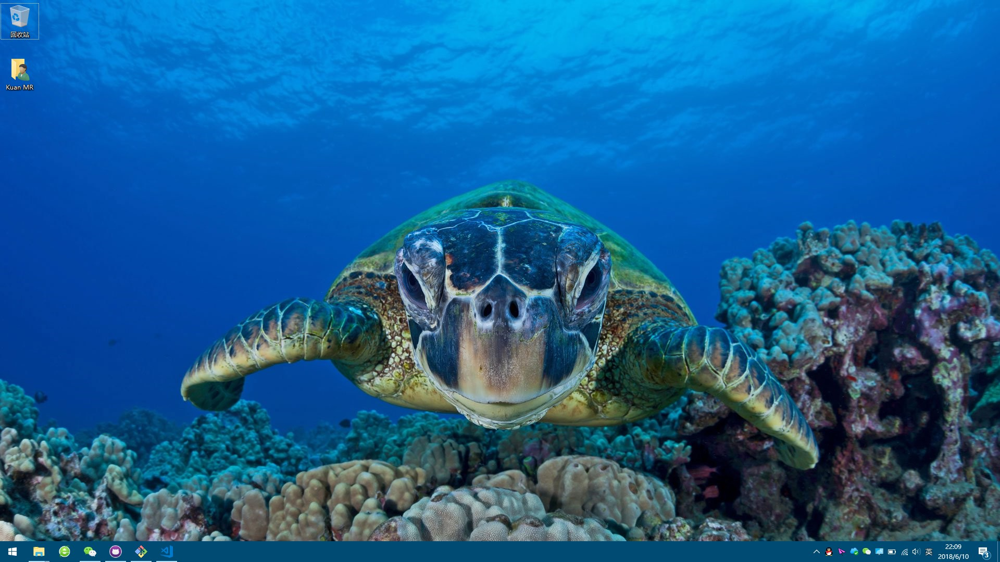

<!-- more -->

# 前序

由于神船笔记本不幸被老婆砸坏（复杂原因。。。），痛定思痛好好做人，买了个小米笔记本pro15.6 16G 版，今天给它重新装了win10专业版，office全家桶，自带的家庭版和office三剑客太LJ了，不要，找到官网后将它[驱动](http://www.mi.com/service/bijiben/drivers/15/)重新安装了下，感觉还不错，原本还计划安装小米笔记本黑苹果系统，但是还达不到我要的完美，没有WIFI驱动，不是很完美，如果解决了相关问题，用黑苹果做主力还是可以的

# 博客转移

前面啰嗦了点，主要是讲博客恢复，参考了 **auto_install.bat**，如果当时没做相关笔记，又要百度，所以记笔记很重要，恢复的过程很快

# 后续

计划博客能有点干货，前期太水，都是搬运，总结，没人爱看，想出点干货的东西，同时准备给相关博客加下锁，私人的东西还是不放出来，尽量走技术路线，不要水了。。。

> 2018年6月10日 22点23分 写于 小米笔记本pro 15.6
